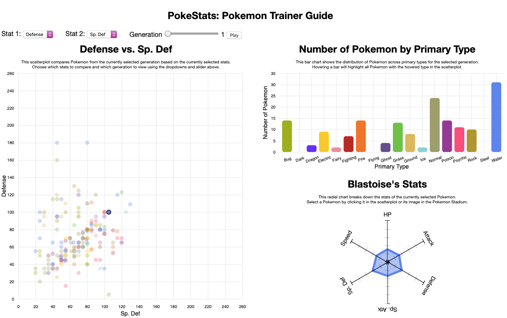
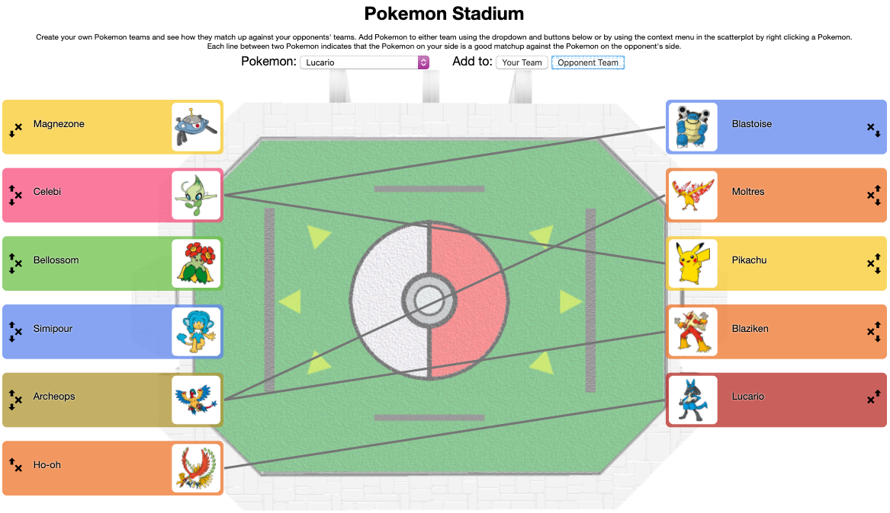

# project_elite3
<h2>Rationale for design choices</h2>

Our table of data contained 800 rows that each represent a Pokemon. Out of all the attributes, the only unique attribute is the name. The # attribute is not unique because variations of the same Pokemon, such as Charizard and Mega Charizard, have the same #. There are 721 different #s. For the ‘Type 1’ and ‘Type 2’ attribute, there are 18 unique types and for the quantitative stat attributes (Total, HP, Attack, Defense, Sp. Atk, Sp. Def, Speed), those all had a similar range, ranging from [0, 255].

Throughout all the views, we encoded the ‘Type 1’ attribute using color hue. Although 18 different hues might be difficult to distinguish, we believe it was appropriate since we used color hues similar to what is in the actual Pokemon game, which users will be familiar with due to the emphasis of these colours in-game. We did not encode the 'Type 2' attribute as well because we felt it would be too much for the user to look at colors for both the primary and secondary type. It would probably make things confusing and cluttered.

To visualize the Pokemon stat attributes, we decided to plot the data on a scatterplot to give a ‘Stat 1’ vs. ‘Stat 2’ comparison, which are encoded by vertical and horizontal position on a common scale, respectively. Pokemon are represented by point marks. We believe it was appropriate since people might want to [identify] trends between the attributes and [locate] outliers for certain Pokemon stats. The user can change which stats he wants to visualize using the dropdowns at the top of the page, and filter what data is shown by using the ‘Generation’ slider. The scatterplot axis goes from [0, 260] which is appropriate for any of the stats. We decided the axis should stay the same when changing stats since it is easier to see how points move around with animations. Hovering over a Pokemon's point will highlight it and all other Pokemon with the same 'Type 1' in the scatterplot. A Pokemon's point can be selected too, in which case it will stay highlighted. This allows the user to easily follow the Pokemon's position in the scatterplot as the stats being visualized change. Hovering over a Pokemon's point also shows a tooltip to allow users to see what Pokemon they're seeing. It shows them the name, types, and # of the hovered Pokemon.

In order to better visualize the type attributes, the scatterplot and barchart are linked. The categorical attribute (‘Type 1’) is on the x-axis, encoded by horizontal position on a common scale as well as color. A count of how many items (Pokemon) there are is on the y-axis. The bar chart uses line marks that are height encoded to show this count. When points are hovered in the scatterplot, the corresponding ‘Type 1’ of that item is highlighted in the barchart. The reverse is also possible. By highlighting a bar in the barchart, all of the Pokemon of that specific type are highlighted in the scatterplot. This provides an easy way for users to [browse] for Pokemon. For example, one use-case scenario is that a user wants to find a fire-type that has both high attack and HP. The user could set those stats in the scatterplot, then hover over the fire bar in the bar chart to find the best compromise of both of these stats. Hovering over a bar also displays a tooltip telling the user the exact count of Pokemon in the selected generation of the hovered 'Type 1'. This allows users to precisely identify the count if they have any confusion.

The scatterplot gave users a way to compare 2 stat attributes at a time. It provided an overview of the data, whereas the radial chart gives us more detail. When a point is selected by clicking in the scatterplot, the radial chart is rendered to give a breakdown the 6 quantitative stat attributes. In this case we believe a radial chart was appropriate since the sum of the stat attributes gives a general idea of how powerful a Pokemon is. The total area in the radial chart roughly encodes the total stats of the Pokemon, while radial length encodes each stat. Users might want an even more detailed breakdown so hovering anywhere over the chart shows a tooltip with the actual numbers and more details. If no Pokemon is selected, the radial chart will show the stats of an average Pokemon from the currently selected generation. This allows the user to view the 'power creep' of Pokemon over the generations (Pokemon having more and more total stats) by pressing the 'Play' button next to the generation slider, which will automatically filter through the generations.

For our innovative view, we wanted an interactive visualization that would make the most optimal recommendations for which of your Pokemon to battle with your opponent’s. At an abstract level, the recommendations are created by taking two sets of data (your Pokemon objects and your opponent’s Pokemon objects) and making recommendations based on parameters in each dataset object. Each Pokemon object is represented with a point mark. The color hue of the point encodes the Pokemon type. The horizontal position of the point mark encodes which team the Pokemon is on. The recommendation is represented with a connection line mark joining two points. The recommendation will recommend that the user attack with its Pokemon with the highest stats. If we don’t account for type advantages, this would mean the strongest Pokemon will attack all of the opponent’s team. However, our recommendation also takes type advantages into consideration. For example, Since water type has a 2x multiplier against fire type, the attack stats would double. This could potentially make a weaker water type Pokemon a better recommendation than a stronger Pokemon without a type advantage. The interactive components allow a user to add, delete, and reorder each dataset, which allows the user to modify the datasets to obtain the data the user requires. In other words, the user can recreate his/her Pokemon team and the opponent’s team exactly. Although the recommendation calculations are not influenced by the order of the datasets, the reason we allowed re-ordering of the datasets is for the user to match their own actual teams in their Pokemon game.

The innovative view is linked to the scatterplot through the scatterplot's context menu, which appears if you right click on a Pokemon's point in the scatterplot. It allows you to add that Pokemon to your team or the opponent's team in the innovative view. This makes is easier for users to assemble teams from Pokemon whose stats they're visualizing in the scatterplot. The innovative view is also linked to the radial chart. If you select a Pokemon's image from the innovative view, the radial chart will display that Pokemon's stats. The rationale is identical to that of linking the scatterplot with the radial chart: this allows a detailed view of the Pokemon's stats and power level.

<h2>Vision changes since proposal</h2>

<b>How have your visualization goals changed?</b>

Originally we had planned to visualize 6 generations worth of Pokemon data. We have changed to only visualizing the first 5 generations. We chose this because we were unable to find a convenient database of sprites (pictures) to use for our innovative visualization for 6th generation Pokemon. Another change was that we decided to also link our innovative view to the radial chart. Now, selecting a Pokemon in the innovative view will show its stats in the radial chart. We did this because we figured users would want to quickly visualize the stats of the Pokemon in their team or their opponent’s team. We also changed how we decided to lay out the charts. The scatterplot shows the most information (highest information density) so we have that in the top left taking up a large area. To the right of the scatterplot, we have both the bar chart, and radial chart stacked together. We decided to make them smaller and put them closer so the user can more easily read between the 3 views. Our innovative view is below that and takes up a wider width since there is more interaction, and a bigger area is easier to interact with.

<b>Does your visualization enable the tasks you set out to facilitate or successfully communicate the story you want to tell?</b>

Yes, our visualization successfully enables the tasks we set out to facilitate, such as [identifying] the Pokemon from each generation with the best stats or [discovering] new Pokemon. Pokemon of a specific generation can easily be [identified] since we filter the scatter plot with a slider for the Pokemon generation. All of the Pokemon of each generation are plotted according to their stats and the scatter plot and bar chart are linked so it is easy to [explore] the data and [discover] new Pokemon. The scatter plot allows people to easily [browse] Pokemon with high stats, and by selecting the Pokemon, they can easily visualize the total stat breakdown of the Pokemon they chose in the radial chart. With our innovative “Pokemon Stadium” view, Pokemon players can simulate battles between teams they create and see which Pokemon match well against each other. The Pokemon are matched based on their stats, and the Pokemon type advantages/disadvantages are taken into consideration as well. Both casual and serious Pokemon players and fans can [enjoy] using this view and use it to compare their teams to other teams. The “Pokemon Stadium” view is also linked to the other charts as well which allows for easy data exploration.

<h2>Prototype screenshots</h2>

<h2>Original data source</h2>

Main Data source: Pokemon.csv [https://www.kaggle.com/abcsds/pokemon](https://www.kaggle.com/abcsds/pokemon)

Sprites: [https://www.youtube.com/watch?v=17SjD0eJSks](https://www.youtube.com/watch?v=17SjD0eJSks) (download link in description)

Background: https://res.cloudinary.com/dmsuvanyj/image/upload/v1478619334/14uanx2_zclwui.png?fbclid=IwAR17IU9yFvvq_hYPVi15fw7M-bO37QpyCyTY-4EmKHP8fWMInCY7Xrn0oO8

Type advantages/disadvantages: type_efficacy.csv and types.csv

- Types.csv: [https://github.com/veekun/pokedex/blob/master/pokedex/data/csv/types.csv](https://github.com/veekun/pokedex/blob/master/pokedex/data/csv/types.csv)

- Type_efficacy.csv: [https://github.com/veekun/pokedex/blob/master/pokedex/data/csv/type_efficacy.csv](https://github.com/veekun/pokedex/blob/master/pokedex/data/csv/type_efficacy.csv)

<h2>Data preprocessing pipeline</h2>

Main data:
<ol>
    <li>Load the main data source in.</li>
    <li>Change strings to numbers for numeric properties such as Attack.</li>
    <li>Change ‘True’ and ‘False’ strings to booleans for the Legendary property.</li>
    <li>Get a list of all the unique types, for use in the bar chart (categories for the x axis).</li>
    <li>Filter the data by the currently selected generation. This is what gets used by the scatterplot and radial chart. We only allow the selection of generations 1 through 5. The innovative view uses the unfiltered data, as does the radial chart for the special case when a Pokemon is selected from the innovative view.</li>
    <li>For the selected generations data, calculate how many Pokemon there are of each type. This is the data used by the bar chart visualization.</li>
</ol>
Type advantages/disadvantages:
<ol>
    <li>Load types.csv and type_efficacy.csv in.</li>
    <li>Change strings to numbers for all numeric properties</li>
    <li>Load data from types.csv into an array</li>
    <ol type="a">
        <li>Grab columns id and identifier from types.csv. The id is the foreign key used to find the name of *_type_id in type_efficacy.csv.</li>
        <li>Place the type names (identifier column) into an array with id as index for future access.</li>
    </ol>
    <li>Load data from type_efficacy.csv into a 2d array</li>
    <ol type="a">
        <li>Each row from type_efficacy.csv contains a type_id pair and the value associated with the type_id pair.</li>
        <li>Every possible combination pair of type_id’s has a value. Store the value into the 2d array at [damage_type_id][target_type_id]</li>
    </ol>
</ol>    

Sprites:
<ol>
    <li>Grab all of the pokemon names from the main data source.</li>
    <li>Create a regex parser that will take the name as an input and return the filename and path of the sprite image</li>
</ol>

<h2>Project Management & Team Assessment</h2>

### (1) Status Update

* only Milestone 1 and 2 are included, as we haven’t started working on Milestone 3 yet
* First date is estimate. Second date is actual. (If prediction was correct, only 1 date is displayed)

<b>Milestone 1: Project Proposal</b> (Total: 20h, due March 6th)(22h, March 6th)
<ol>
    <li>Brainstorming project ideas (6h, February 24th)(4h, February 27th)</li>
    <li>Basic info (0h, February 28th)</li>
    <li>Overview (1h, February 28th)</li>
    <li>Description of data and data preprocessing (2h, February 28th)</li>
    <li>Usage scenarios & tasks (2h, March 4th)(3h, March 4th)</li>
    <li>Description of your visualization & sketch (4h, March 4th)</li>
    <li>Work breakdown and schedule (3h, March 4th)(5h, March 5th)</li>
    <li>Editing/Formatting (2h, March 5th)(3h, March 5th)</li>
</ol>

<b>Milestone 2: Work-in-Progress</b> (Total: 75h, due March 25th) (Total: 77h, March 23rd)

<ol>
    <li>Implementation (Total: 60h) (62h, March 23rd)</li>
    <ol type="a">
        <li>Initial data preprocessing (2h, March 9th)(4h, March 2nd)</li>
        <li>2 dropdown menus and 1 slider (3h, March 9th)(1h, February 26th)</li>
        <li>Static scatterplot (3h, March 16th)(3h, March 2nd)</li>
        <li>Link scatterplot to dropdowns (2h, March 16th)(2h, March 3rd)</li>
        <li>Static bar graph (3h, March 16th)(2h, March 2rd)</li>
        <li>Link bar graph to dropdowns (2h, March 16th)(1h, March 2nd)</li>
        <li>Link scatterplot and bar graph (hover and select behaviour) (3h, March 16th)(7h, March 3rd)</li>
        <li>Static radial chart (5h, March 16th)(3h, March 4th)</li>
        <li>Link radial chart to scatterplot (2h, March 16th)(3h, March 4th)</li>
        <li>Innovative view component (25h, March 23rd) (40h, March 22nd)</li>
        <ol type="i">
            <li>Choose pokemon (5h, March 16th)(7h, March 7th)</li>
            <li>Circles Recommendation Reason Tooltip (3h, March 16th)(2h, March 22nd)</li>
            <li>Links/Battle UI (2h, March 23rd)(4h, March 22nd)</li>
            <li>Battle logic (3h, March 23rd)(3h, March 22nd)</li>
            <li>Link innovative to other views (2h, March 16th)(3h, March 23rd)</li>
            <li>Scatterplot custom context menu (2h, March 16th)(3h, March 7th)</li>
            <li>Dropdown selector (2h, March 16th)</li>
            <li>Loading Pokemon Sprites (4h, March 16th)(12h, March 18th)</li>
            <li>Add, remove, shift buttons (2h, March 16th)(4h, March 7th)</li>
        </ol>
        <li>Flex hours for whatever takes longer (10h, March 23rd)</li>
    </ol>
    <li>Write-up (15h) (12h, March 23rd)</li>
    <ol type="a">
        <li>Rationale for design choices, focusing on interaction aspects and connecting those choices to a data abstraction (include a characterization of the raw data types and their scale/cardinality, and any derived data) and the task abstraction. Also describe visual encoding choices concisely. (5h, March 16th)(5h, March 22nd)</li>
        <li>How have visualization goals changed since proposal? (2h, March 16th)(1h, March 16th)</li>
        <li>Does the visualization enable the tasks we set out to facilitate or successfully communicate the story we want to tell? (2h, March 16th)(2h, March 22nd)</li>
        <li>Screenshot of current prototype (multiple if necessary) (0h, March 23rd)</li>
        <li>Link to original data source (0h, March 23rd)</li>
        <li>Data preprocessing pipeline description (if exists) (2h, March 23rd)</li>
        <li>Editing/Formatting (2h, March 24th)</li>
    </ol>
    <li>Project Management & Team Assessment (2h, March 23rd)(3h, March 23rd)</li>
    <ol type="a">
        <li>Status update</li>
        <li>Contributions breakdown</li>
        <li>Team process</li>
    </ol>
</ol>

### (2) Contributions Breakdown

<b>Briefly describe which team member worked on which tasks and their responsiblities. Did everyone contribute equally?</b>

For the most part, everyone worked on what they indicated they would in the Work Breakdown from milestone 1. We believe that everyone contributed equally.

For programming, Andrew was responsible for part of the initial data preprocessing as well as the creation and linking of the ‘standard’ visualizations: scatterplot, bar chart, and radial chart. He also made the stat dropdown menus and generation slider and linked those to the aforementioned visualizations. On the write-up side, Andrew worked on ‘Vision changes since proposal’, ‘Link to original data source’, ‘Data preprocessing pipeline’, and editing/formatting.

For programming, Kevin was responsible for the adding ways to add Pokemon to the innovative view such as the dropdown and scatterplot context menu, most of the innovative view rendering, and the innovative view buttons such as the move up/down and remove. He also linked the innovative view to the radial chart as well, and created the tooltip that is used throughout. For the write-up side, Kevin and Mark worked together on “Rationale for design choices …”, “Does the visualization enable the tasks we set out …”, and adding screenshots of the current prototype.

For programming, Mark was responsible for the backend logic of the innovative view. He created the function for the battle logic (recommendations). He also found the sprite images source, and created the regex parsers and functions that would grab the proper sprite image from the local data. He also pre-processed type_efficacy.csv and types.csv. He also created the function that formatted the name from the main dataset to the display name. See above for the write-up contributions.

### (3) Team Process

<b>Rank: weak, satisfactory, good, or excellent.
    <ul>
        <li>Team has a clear vision of the problem(s) <b>EXCELLENT</b></li>
        <li>Team is properly organized to complete task and cooperates well <b>EXCELLENT</b></li>
        <li>Team managed time wisely <b>EXCELLENT</b></li>
        <li>Team acquired needed knowledge base <b>EXCELLENT</b></li>
        <li>Efforts communicated well within group <b>EXCELLENT</b></li>
    </ul>

We did not have any issues. Hooray!